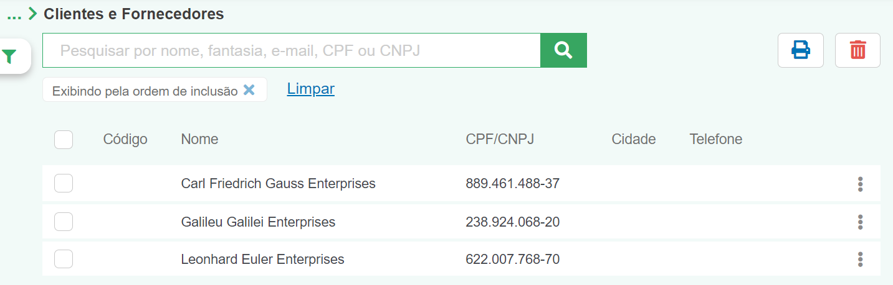
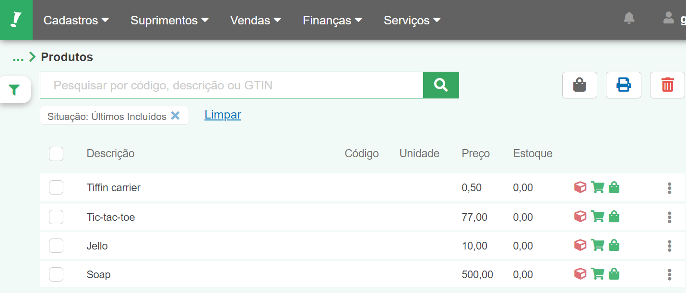
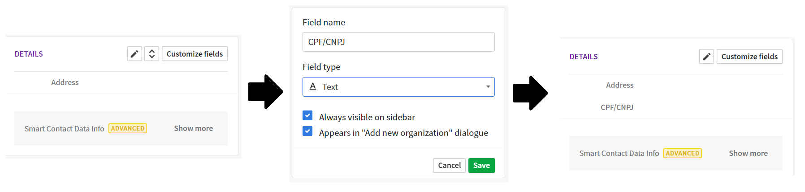
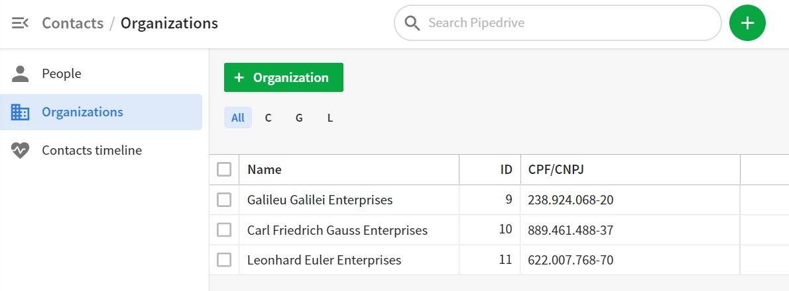
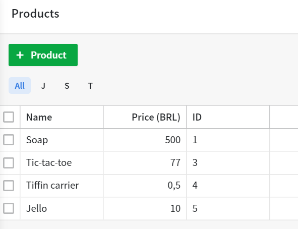
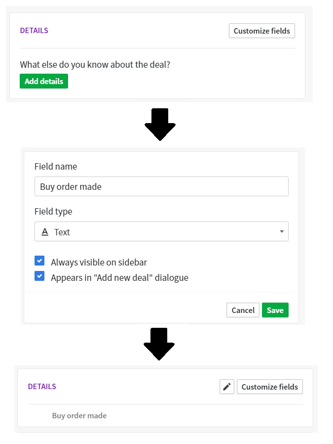
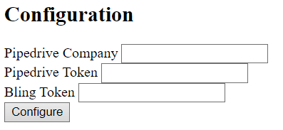
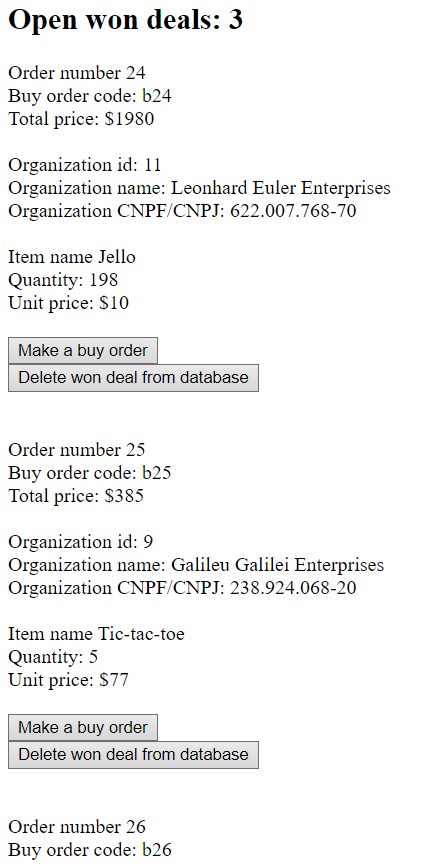

# ⚠️ Still in progress

## 🖥️ Project name: _Pipebling: The Integration_.

## 🤔 Why did you made this project?

I wanted to learn API's integration. Got the idea from this [repository](https://github.com/leonardo-jesus/pipedrive-bling-integration).

## 💬 What is it?

An integration between Pipedrive and Bling API's. I will put some other goals in the future, but the major feature is to search for won deals in Pipedrive, and send a buy order to Bling. Ideally, you will be able to do this in two ways, by a manual press of a button (already implemented), or by setting a Webhook on Pipedrive (for the future).

## 🛠️ What technologies did you use?

-   HTML
-   CSS
-   Javascript
-   Node.js
-   Express.js
-   MongoDB Atlas
-   EJS
-   Heroku
-   Axios
-   Webhook
-   Pipedrive API
-   Bling API

## 🕹️ How to execute?

## Setup

The products and organizations in both Bling and Pipedrive must have some coincident and required information. This chapter is divided in the following sections:

1. Bling organization
1. Bling products
1. Bling API user
1. Bling IP access
1. Pipedrive organization
1. Pipedrive products
1. Deal custom field

All the CPFs were randomly generated [here](https://www.4devs.com.br/gerador_de_cpf).

### 1. Bling organization

Insert the following data for each organization:

-   Nome
-   CPF/CNPJ
-   UF
-   Tipo de contato: must be `Fornecedor`

Bling organizations will look like this:



### 2. Bling products

Insert the following data for each product:

-   Descrição
-   Preço venda



### 3. Bling API user

To use the Bling API, you need a API User. To create one, go to:

`Preferências -> Sistema -> Usuários e usuário API -> + Incluir cadastro -> Usuário API`

Set all the necessary permissions and store the `API key` somewhere.

### 4. Bling IP access

You also need to give Bling your IP. Go to:

`Preferências -> Integrações -> API Para Web Services`

You can check your IP [here](https://whatismyip.com.br/).

### 5. Pipedrive organization

Here you will be adding a custom field, called `CPF/CPNJ`. First, create a organization with only a `name`.

After that, create a custom field, exemplified in the image below.



Now, you must insert the `CPF/CPNJ` of the organization. In the end, it will look like this:



Remember, the minimum information needed is the `name` and the `CPF/CPNJ` of the organization.

### 6. Pipedrive products

Insert the following data for each product:

-   Product name
-   Unit price



### 7. Pipedrive deal custom field

You will be adding a custom field called `Buy order made`. It tells if a deal was already transformed into a order at Bling, so every time we import the deals in our application, the deals already ordered at Bling won't be imported. Create a deal with at least a `Organization` and a `product`, and do the following steps:



Fill the custom field with only `True` or `False`.

## Running the application

Clone this repository

```
git clone https://github.com/gabrielnardes/pipebling.git
```

Install the dependencies

```
npm install
```

Start the server

```
npm run start
```

Open `http://localhost:3000` in your browser

In the `Configuration` page: `http://localhost:3000/config`

Insert your data:



Press the `Configure` button. Finally, you are all set.

## Import won deals

It will import all won deals in Pipedrive with `Buy order status` equals to `False`.

## Show open won deals

It will show all the open won deals that were already imported from the Pipedrive to the database.



### Make a buy order

It will connect to the Bling API, do some checks, and create a buy order at Bling. After that, it will update the buy order status at Pipedrive to `True`, to make sure to not import this deal again, and delete the deal from database.

### Delete won deal from database

Delete entry only at database, not from Pipedrive. If you press `Import won deals`, it will be imported again.

<br>
<p align="center">Made by <a href="https://www.linkedin.com/in/gabriel-nardes-giampietro/">Gabriel Nardes Giampietro</a>👍
